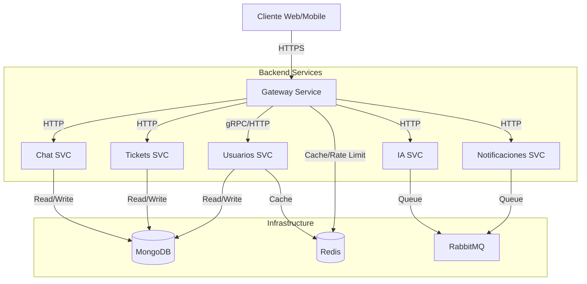

# AURONTEK Deployment Guide

Este documento detalla el proceso de despliegue, configuración y arquitectura del sistema AURONTEK en el entorno de producción (EC2).

## 1. Arquitectura del Sistema

### 1.1 Diagrama de Servicios



### 1.5 Redis (Nuevo)
El sistema ahora incluye un contenedor de Redis en producción para:
- Rate Limiting en el Gateway
- Caché de sesiones y perfiles de usuario
- Gestión de colas de trabajos ligeros

**Configuración:**
- Límite de memoria: 50MB
- Política de evicción: `allkeys-lru`
- Persistencia: Deshabilitada (solo caché)

## 3. Configuración de Entorno

### 3.2 GitHub Secrets
Las siguientes variables deben estar configuradas en los secretos del repositorio para el despliegue automático:

| Variable | Descripción |
|----------|-------------|
| `DOCKER_USERNAME` | Usuario de Docker Hub |
| `DOCKER_PASSWORD` | Token de acceso de Docker Hub |
| `EC2_HOST` | Dirección IP del servidor de producción |
| `EC2_USERNAME` | Usuario SSH (ej. ubuntu) |
| `EC2_SSH_KEY` | Llave privada SSH |
| `MONGODB_URI` | String de conexión a MongoDB Atlas |
| `RABBITMQ_URL` | URL de conexión a RabbitMQ (CloudAMQP) |
| `REDIS_URL` | **(Nuevo)** URL de conexión a Redis |
| `SERVICE_TOKEN` | **(Nuevo)** Token para autenticación entre microservicios |
| `FRONTEND_URL` | **(Nuevo)** URL del frontend en Vercel para configuración CORS |
| `CUSTOM_DOMAIN` | **(Nuevo)** Dominio personalizado con HTTPS (ej: https://tuapp.ddns.net) |
| `RECAPTCHA_TEST_TOKEN` | **(Nuevo)** Token de prueba para bypass de reCAPTCHA en tests |
| `JWT_SECRET` | Secret para firma de tokens JWT |

## 4. Configuración de SSL con Dominio Personalizado

Si deseas usar un dominio personalizado (como No-IP) con SSL:

1. **Configurar dominio**: Apunta tu dominio a la IP pública de EC2
2. **Instalar SSL**: Ejecuta el script automatizado:
   ```bash
   sudo ./scripts/setup-ssl.sh
   ```
3. **Configurar variables**: Agrega `CUSTOM_DOMAIN` a tus variables de entorno
4. **Actualizar Vercel**: Cambia `VITE_API_URL` a tu dominio personalizado

Para más detalles, consulta [SSL_SETUP_GUIDE.md](./SSL_SETUP_GUIDE.md).

## 5. Monitoreo y Logs

### 5.1 Comandos de Monitoreo
Para verificar el estado de los servicios en el servidor EC2:

```bash
# Ver estado de todos los contenedores (incluyendo Redis)
docker ps --format "table {{.Names}}\t{{.Status}}\t{{.Ports}}"

# Ver logs de un servicio específico
docker logs -f aurontek-gateway-svc
docker logs -f aurontek-redis

# Ver uso de recursos
docker stats
```

## 6. Health Checks

### 6.2 Servicios Verificados
El sistema de orquestación verifica automáticamente la salud de los siguientes servicios antes de enrutar tráfico:

- **Gateway**: `/health`
- **Usuarios**: `/health`
- **Tickets**: `/health`
- **Chat**: `/health`
- **IA**: `/health`
- **Redis**: `redis-cli ping`

Los servicios dependientes están configurados con `condition: service_healthy` para asegurar un inicio ordenado.

## 7. Límites de Recursos

Se han establecido los siguientes límites duros de memoria para prevenir OOM (Out of Memory) en el servidor:

| Servicio | Límite de Memoria |
|----------|-------------------|
| Gateway | 150MB |
| Usuarios | 150MB |
| Tickets | 150MB |
| Chat | 150MB |
| Notificaciones | 150MB |
| IA | 200MB |
| Redis | 50MB |

Total estimado de consumo base: ~1GB RAM.