# 🏗️ AURONTEK CI/CD Architecture

This document provides a visual overview of the complete CI/CD pipeline and production architecture.

---

## CI/CD Pipeline Flow

```mermaid
graph TB
    subgraph "Developer Workflow"
        DEV[👨‍💻 Developer pushes to dev]
        TEST[🧪 Merge dev → test]
        PROD[🚀 Merge test → main]
    end
    
    subgraph "GitHub Actions - CI Job"
        CI1[🔨 Build all Docker images]
        CI2[✅ Verify builds succeed]
    end
    
    subgraph "GitHub Actions - Deploy Job - main only"
        CD1[📦 Push images to Docker Hub]
        CD2[🔐 SSH into EC2]
        CD3[⬇️ Pull latest images]
        CD4[🔄 Restart services]
    end
    
    subgraph "Vercel - Frontend"
        V1[🌐 Deploy frontend]
        V2{Branch?}
        V3[📱 Preview - dev]
        V4[📱 Preview - test]
        V5[✨ Production - main]
    end
    
    DEV --> CI1
    TEST --> CI1
    PROD --> CI1
    
    CI1 --> CI2
    
    CI2 --> V1
    V1 --> V2
    V2 -->|dev| V3
    V2 -->|test| V4
    V2 -->|main| V5
    
    CI2 -->|main only| CD1
    CD1 --> CD2
    CD2 --> CD3
    CD3 --> CD4
```



---

## Production Architecture

```mermaid
graph TB
    subgraph "User"
        USER[🧑 End User]
    end
    
    subgraph "Frontend - Vercel Cloud"
        VERCEL[⚛️ React App<br/>Global CDN<br/>Auto HTTPS]
    end
    
    subgraph "Backend - AWS EC2 t2.micro"
        NGINX[🌐 Nginx - Optional<br/>Port 80/443]
        GATEWAY[🚪 API Gateway<br/>Port 3000<br/>150MB RAM]
        
        subgraph "Microservices"
            USR[👤 Usuarios Service<br/>Port 3001<br/>150MB RAM]
            TKT[🎫 Tickets Service<br/>Port 3002<br/>150MB RAM]
            CHAT[💬 Chat Service<br/>Port 3003<br/>150MB RAM]
            NOTIF[📧 Notifications Service<br/>Port 3004<br/>150MB RAM]
            AI[🤖 IA Service Python<br/>Port 3005<br/>200MB RAM]
        end
        
        SWAP[💾 4GB Swap Memory<br/>Critical for t2.micro]
    end
    
    subgraph "External Cloud Services"
        MONGO[(🍃 MongoDB Atlas<br/>M0 Free Tier<br/>~400MB saved)]
        RABBIT[🐰 CloudAMQP<br/>Lemur Free Plan<br/>~150MB saved]
        CLOUD[☁️ Cloudinary<br/>Image Storage]
        SMTP[📮 Gmail SMTP<br/>Email Delivery]
    end
    
    USER --> VERCEL
    VERCEL -->|API Requests| NGINX
    NGINX --> GATEWAY
    USER -->|Direct API| GATEWAY
    
    GATEWAY --> USR
    GATEWAY --> TKT
    GATEWAY --> CHAT
    GATEWAY --> NOTIF
    
    USR -.->|Auth/Users| MONGO
    TKT -.->|Tickets Data| MONGO
    CHAT -.->|Messages| MONGO
    
    TKT -.->|Message Queue| RABBIT
    CHAT -.->|Message Queue| RABBIT
    NOTIF -.->|Message Queue| RABBIT
    AI -.->|Message Queue| RABBIT
    
    USR -.->|Upload Images| CLOUD
    NOTIF -.->|Send Emails| SMTP
    
    GATEWAY -.->|Calls| AI
    
    style VERCEL fill:#000,stroke:#fff,color:#fff
    style MONGO fill:#4DB33D,stroke:#3FA037,color:#fff
    style RABBIT fill:#FF6600,stroke:#E55B00,color:#fff
    style EC2 fill:#FF9900,stroke:#E58700,color:#000
```



---

## Resource Allocation (EC2 t2.micro)


### Why Swap is Critical ✨

Without swap, the t2.micro (1GB RAM) would crash when running 6 services (~950MB total).

**With 4GB swap:**
- Services can temporarily use disk when RAM is full
- Prevents OOM (Out of Memory) kills
- Allows smooth operation under load

---

## Deployment Flow - Step by Step

```mermaid
sequenceDiagram
    participant Dev as 👨‍💻 Developer
    participant Git as 🐙 GitHub
    participant GHA as ⚙️ GitHub Actions
    participant DHub as 🐳 Docker Hub
    participant EC2 as 🖥️ AWS EC2
    participant Vercel as ▲ Vercel
    
    Dev->>Git: git push origin main
    Git->>GHA: Trigger CI/CD workflow
    
    par CI Job
        GHA->>GHA: Build 6 Docker images
        GHA->>GHA: Run tests
    end
    
    par Frontend Deployment
        GHA->>Vercel: Trigger deploy
        Vercel->>Vercel: Build React app
        Vercel->>Vercel: Deploy to CDN
    end
    
    par Backend Deployment (main only)
        GHA->>DHub: Push all 6 images
        GHA->>EC2: SSH connect
        EC2->>DHub: Pull latest images
        EC2->>EC2: docker-compose up -d
        EC2->>EC2: Restart services
    end
    
    GHA->>Dev: ✅ Deployment successful
```



---

## Branch Protection & Workflow

```mermaid
gitGraph
    commit id: "Initial"
    branch dev
    checkout dev
    commit id: "Feature A"
    commit id: "Feature B"
    checkout main
    merge dev tag: "CI only (build)"
    
    checkout dev
    commit id: "Feature C"
    branch test
    checkout test
    merge dev tag: "CI only (test)"
    
    checkout test
    commit id: "Bug fix"
    checkout main
    merge test tag: "CI + CD (DEPLOY) 🚀"
```

### Git Branch Strategy

| Branch | Purpose | CI | CD | Vercel |
|--------|---------|----|----|--------|
| `dev` | Active development | ✅ Build | ❌ No deploy | 📱 Preview |
| `test` | QA testing | ✅ Build | ❌ No deploy | 📱 Preview |
| `main` | Production | ✅ Build | ✅ **Deploy to EC2** | ✨ Production |

---

## Data Flow

```mermaid
graph LR
    subgraph "Client"
        A[🧑 User Browser]
    end
    
    subgraph "Vercel"
        B[⚛️ React Frontend]
    end
    
    subgraph "EC2"
        C[🚪 Gateway :3000]
    end
    
    subgraph "Services"
        D[👤 Usuarios :3001]
        E[🎫 Tickets :3002]
        F[💬 Chat :3003]
    end
    
    subgraph "Cloud"
        G[(🍃 MongoDB Atlas)]
        H[🐰 CloudAMQP]
    end
    
    A -->|HTTPS| B
    B -->|REST API| C
    C -->|Internal| D
    C -->|Internal| E
    C -->|Internal| F
    
    D -->|Read/Write| G
    E -->|Read/Write| G
    F -->|Read/Write| G
    
    E -->|Publish Events| H
    F -->|Subscribe Events| H
```



---

## Security Considerations

### ✅ What's Secure

- All secrets stored in GitHub Secrets (encrypted)
- SSH key authentication for EC2 access
- JWT tokens for API authentication
- MongoDB Atlas uses SSL/TLS encryption
- CloudAMQP uses AMQPS (SSL)
- Vercel provides automatic HTTPS

### ⚠️ Recommended Improvements

1. **Add HTTPS to EC2:**
   - Use Let's Encrypt with Nginx
   - Configure SSL certificates
   - Redirect HTTP → HTTPS

2. **Restrict Security Group:**
   - Change SSH (port 22) from `0.0.0.0/0` to your IP only
   - Use AWS Session Manager instead of SSH

3. **Environment Variables:**
   - Rotate `JWT_SECRET` regularly
   - Use strong passwords for all services
   - Never commit `.env` files to Git

4. **Database Security:**
   - MongoDB Atlas IP whitelist (although 0.0.0.0/0 works for Free Tier)
   - Enable MongoDB authentication
   - Regular backups

---

## Cost Breakdown (Free Tier)

| Service | Plan | Monthly Cost |
|---------|------|--------------|
| AWS EC2 t2.micro | Free Tier (12 months) | $0 |
| MongoDB Atlas | M0 Sandbox | $0 |
| CloudAMQP | Lemur Plan | $0 |
| Vercel | Hobby Plan | $0 |
| Docker Hub | Free Plan | $0 |
| **Total** | | **$0/month** |

### After Free Tier Expires (12 months)

| Service | Cost |
|---------|------|
| EC2 t2.micro | ~$8.50/month |
| MongoDB Atlas M0 | Still Free |
| CloudAMQP Lemur | Still Free |
| Vercel | Still Free |
| **Total** | **~$8.50/month** |

---

## Monitoring & Logs

### Available Monitoring

1. **GitHub Actions:**
   - View all deployments
   - Build times
   - Success/failure rates

2. **Vercel Dashboard:**
   - Frontend performance
   - Build logs
   - Analytics

3. **EC2 Metrics:**
   ```bash
   htop              # CPU/Memory
   docker stats      # Container resources
   docker logs -f    # Application logs
   ```

4. **External Services:**
   - MongoDB Atlas → Performance metrics
   - CloudAMQP → Message queue stats

### Recommended Additions

- **Application Monitoring:** Add Sentry for error tracking
- **Uptime Monitoring:** Use UptimeRobot (free)
- **Logging:** Consider Papertrail or Loggly for centralized logs

---

## Next Steps

1. ✅ Review this architecture
2. ⏭️ Follow [DEPLOYMENT_GUIDE.md](./DEPLOYMENT_GUIDE.md) step-by-step
3. 🚀 Deploy to production
4. 📊 Monitor and iterate

**Questions? Check [QUICK_REFERENCE.md](./QUICK_REFERENCE.md) for common commands.**
