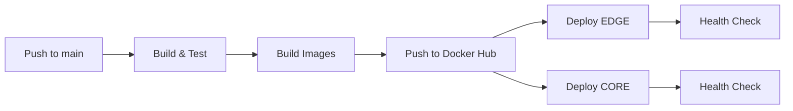

# 🚀 AURONTEK - Presentación del Proyecto

## Sistema de Gestión de Tickets Empresariales

---

## 📋 Índice

1. [Introducción](#introducción)
2. [Objetivos](#objetivos)
3. [Arquitectura](#arquitectura)
4. [Stack Tecnológico](#stack-tecnológico)
5. [Modelo de Datos](#modelo-de-datos)
6. [Funcionalidades](#funcionalidades)
7. [Seguridad](#seguridad)
8. [Deployment](#deployment)
9. [Métricas y Performance](#métricas)
10. [Roadmap](#roadmap)

---

## 1. 📖 Introducción

### ¿Qué es AURONTEK?

AURONTEK es un **sistema completo de gestión de tickets empresariales** diseñado para optimizar el soporte técnico y la atención al cliente mediante una arquitectura de microservicios moderna y escalable.

### Problema que Resuelve

- ❌ **Gestión ineficiente** de tickets de soporte
- ❌ **Falta de trazabilidad** en solicitudes
- ❌ **Comunicación fragmentada** entre equipos
- ❌ **Ausencia de métricas** de rendimiento
- ❌ **Procesos manuales** repetitivos

### Solución

- ✅ **Centralización** de todas las solicitudes
- ✅ **Automatización** de asignaciones y notificaciones
- ✅ **Trazabilidad completa** del ciclo de vida
- ✅ **Dashboard en tiempo real** con métricas
- ✅ **IA integrada** para análisis y sugerencias

---

## 2. 🎯 Objetivos

### Objetivos de Negocio

1. **Mejorar la eficiencia** del equipo de soporte en un 40%
2. **Reducir el tiempo de respuesta** promedio a menos de 2 horas
3. **Aumentar la satisfacción del cliente** (NPS > 80)
4. **Automatizar el 60%** de las tareas repetitivas
5. **Escalar** a 100+ empresas sin incrementar costos

### Objetivos Técnicos

1. **Alta disponibilidad** (Uptime > 99.5%)
2. **Performance óptimo** (Response time < 200ms)
3. **Seguridad robusta** (OWASP Top 10 cubierto)
4. **Escalabilidad horizontal** (microservicios)
5. **Deployment automático** (CI/CD)
6. **Costos optimizados** (AWS Free Tier)

---

## 3. 🏗️ Arquitectura

### 3.1 Arquitectura General

```
┌─────────────────────────────────────────────────────────────────┐
│                         FRONTEND (Vercel)                        │
│                    React + Vite + TailwindCSS                    │
└────────────────────────┬────────────────────────────────────────┘
                         │ HTTPS
                         ▼
┌─────────────────────────────────────────────────────────────────┐
│                    NGINX (EDGE EC2) - SSL/TLS                    │
│                  Let's Encrypt + Reverse Proxy                   │
└────────────────────────┬────────────────────────────────────────┘
                         │
                         ▼
┌─────────────────────────────────────────────────────────────────┐
│                     API GATEWAY (EDGE EC2)                       │
│           CORS • Rate Limiting • Authentication                  │
│                    Express.js + Redis                            │
└──────┬──────────┬──────────┬──────────┬──────────┬─────────────┘
       │          │          │          │          │
       ▼          ▼          ▼          ▼          ▼
┌──────────┐ ┌──────────┐ ┌──────────┐ ┌──────────┐ ┌──────────┐
│ Usuarios │ │ Tickets  │ │   Chat   │ │Notifica- │ │    IA    │
│   SVC    │ │   SVC    │ │   SVC    │ │ciones SVC│ │   SVC    │
│ (CORE)   │ │ (CORE)   │ │ (CORE)   │ │ (CORE)   │ │ (CORE)   │
└────┬─────┘ └────┬─────┘ └────┬─────┘ └────┬─────┘ └────┬─────┘
     │            │            │            │            │
     └────────────┴────────────┴────────────┴────────────┘
                              │
                              ▼
                    ┌──────────────────┐
                    │  MongoDB Atlas   │
                    │  (Database)      │
                    └──────────────────┘
```

### 3.2 Arquitectura Dual-EC2

#### **EDGE (EC2 Pública)**
- **Rol:** Punto de entrada público
- **Servicios:**
  - Nginx (Reverse Proxy + SSL)
  - Gateway (API Gateway)
  - Redis (Cache + Rate Limiting)
- **Memoria:** ~270MB
- **IP:** Pública + Privada

#### **CORE (EC2 Privada)**
- **Rol:** Lógica de negocio
- **Servicios:**
  - usuarios-svc (Autenticación)
  - tickets-svc (CRUD Tickets)
  - chat-svc (WebSockets)
  - notificaciones-svc (Emails)
  - ia-svc (Análisis IA)
- **Memoria:** ~900MB
- **IP:** Solo privada

### 3.3 Patrón de Arquitectura

**Microservicios + API Gateway + Event-Driven**

- ✅ **Microservicios:** Servicios independientes y especializados
- ✅ **API Gateway:** Punto único de entrada
- ✅ **Event-Driven:** RabbitMQ para comunicación asíncrona
- ✅ **Cache:** Redis para performance
- ✅ **CQRS:** Separación de lecturas y escrituras

---

## 4. 💻 Stack Tecnológico

### 4.1 ¿Qué es MERN?

**MERN** es un stack tecnológico completo para desarrollo web:

- **M**ongoDB - Base de datos NoSQL
- **E**xpress.js - Framework backend
- **R**eact - Librería frontend
- **N**ode.js - Runtime JavaScript

### 4.2 Stack Completo de AURONTEK

#### **Frontend**
```
React 18.2          - UI Library
Vite 5.0            - Build tool (más rápido que Webpack)
TailwindCSS 3.4     - Utility-first CSS
React Router 6.20   - Routing
Axios 1.6           - HTTP Client
Socket.IO Client    - WebSockets
Context API         - State Management
React Hook Form     - Form validation
```

#### **Backend (Node.js)**
```
Node.js 18 LTS      - Runtime
Express.js 5.1      - Web framework
TypeScript 5.9      - Type safety
Mongoose 8.0        - MongoDB ODM
Socket.IO 4.6       - WebSockets
bcrypt 5.1          - Password hashing
jsonwebtoken 9.0    - JWT authentication
```

#### **Backend (Python)**
```
Python 3.9          - Runtime (IA service)
FastAPI 0.109       - Web framework
Pydantic 2.5        - Data validation
```

#### **Bases de Datos**
```
MongoDB Atlas 7.0   - Database principal (Free Tier)
Redis 7.0           - Cache + Rate limiting
```

#### **Message Queue**
```
RabbitMQ (CloudAMQP) - Event-driven communication
```

#### **Servicios Externos**
```
Cloudinary          - Image storage
Resend              - Email service
Google reCAPTCHA    - Bot protection
```

#### **DevOps**
```
Docker 24.0         - Containerization
Docker Compose 2.23 - Multi-container orchestration
GitHub Actions      - CI/CD
Nginx 1.24          - Reverse proxy
Let's Encrypt       - SSL certificates
```

#### **Cloud**
```
AWS EC2 (t2.micro)  - Compute (Free Tier)
Vercel              - Frontend hosting
Docker Hub          - Container registry
No-IP               - Dynamic DNS
```

---

## 5. 🗄️ Modelo de Datos

### 5.1 Diagrama ER

```
┌─────────────┐         ┌─────────────┐         ┌─────────────┐
│   Empresa   │────────<│   Usuario   │>────────│     Rol     │
└─────────────┘         └─────────────┘         └─────────────┘
      │                        │                        │
      │                        │                        │
      │                        ▼                        │
      │                 ┌─────────────┐                 │
      └────────────────>│   Ticket    │<────────────────┘
                        └─────────────┘
                               │
                               │
                        ┌──────┴──────┐
                        ▼             ▼
                 ┌─────────────┐ ┌─────────────┐
                 │   Mensaje   │ │  Actividad  │
                 └─────────────┘ └─────────────┘
```

### 5.2 Colecciones MongoDB

#### **Empresas**
```javascript
{
  _id: ObjectId,
  nombre: String,
  rfc: String,
  codigo_acceso: String,  // Único, 8 caracteres
  activo: Boolean,
  fecha_creacion: Date,
  configuracion: {
    logo_url: String,
    color_primario: String,
    timezone: String
  }
}
```

#### **Usuarios**
```javascript
{
  _id: ObjectId,
  nombre: String,
  correo: String,         // Único
  contraseña: String,     // Hasheado con bcrypt
  telefono: String,
  empresa: ObjectId,      // Ref: Empresa
  rol: String,            // Ref: Role
  permisos: [String],
  activo: Boolean,
  estado_actividad: Enum, // 'available', 'busy', 'offline'
  gruposDeAtencion: [String],
  habilidades: [String],
  fecha_creacion: Date
}
```

#### **Roles**
```javascript
{
  _id: ObjectId,
  nombre: String,
  descripcion: String,
  empresa: ObjectId,      // Ref: Empresa (null para roles globales)
  permisos: [String],     // ['tickets.create', 'tickets.view', ...]
  nivel: Number,          // Jerarquía
  activo: Boolean
}
```

#### **Tickets**
```javascript
{
  _id: ObjectId,
  folio: String,          // Auto-generado
  titulo: String,
  descripcion: String,
  prioridad: Enum,        // 'baja', 'media', 'alta', 'urgente'
  estado: Enum,           // 'abierto', 'en_proceso', 'resuelto', 'cerrado'
  categoria: String,
  subcategoria: String,
  empresa: ObjectId,      // Ref: Empresa
  usuarioCreador: ObjectId, // Ref: Usuario
  asignadoA: ObjectId,    // Ref: Usuario
  grupoAtencion: String,
  adjuntos: [{
    url: String,
    tipo: String,
    nombre: String
  }],
  fecha_creacion: Date,
  fecha_actualizacion: Date,
  fecha_cierre: Date,
  sla: {
    tiempo_respuesta: Number,  // minutos
    tiempo_resolucion: Number
  }
}
```

#### **Mensajes (Chat)**
```javascript
{
  _id: ObjectId,
  ticket: ObjectId,       // Ref: Ticket
  usuario: ObjectId,      // Ref: Usuario
  mensaje: String,
  tipo: Enum,             // 'texto', 'imagen', 'archivo'
  adjuntos: [String],
  leido: Boolean,
  fecha_creacion: Date
}
```

#### **Actividades (Audit Trail)**
```javascript
{
  _id: ObjectId,
  ticket: ObjectId,       // Ref: Ticket
  usuario: ObjectId,      // Ref: Usuario
  accion: String,         // 'creado', 'asignado', 'comentado', etc.
  descripcion: String,
  datos_anteriores: Object,
  datos_nuevos: Object,
  fecha: Date
}
```

### 5.3 Índices Optimizados

```javascript
// Usuarios
db.usuarios.createIndex({ correo: 1 }, { unique: true })
db.usuarios.createIndex({ empresa: 1, activo: 1 })

// Tickets
db.tickets.createIndex({ folio: 1 }, { unique: true })
db.tickets.createIndex({ empresa: 1, estado: 1 })
db.tickets.createIndex({ asignadoA: 1, estado: 1 })
db.tickets.createIndex({ fecha_creacion: -1 })

// Mensajes
db.mensajes.createIndex({ ticket: 1, fecha_creacion: -1 })
```

---

## 6. ⚙️ Funcionalidades

### 6.1 Gestión de Tickets

- ✅ **CRUD completo** de tickets
- ✅ **Asignación automática** basada en reglas
- ✅ **Priorización** (baja, media, alta, urgente)
- ✅ **Estados** (abierto, en proceso, resuelto, cerrado)
- ✅ **Categorización** multinivel
- ✅ **Adjuntos** (imágenes, archivos)
- ✅ **SLA tracking** (tiempo de respuesta/resolución)
- ✅ **Historial completo** de cambios

### 6.2 Sistema de Usuarios

- ✅ **Multi-empresa** con aislamiento de datos
- ✅ **RBAC** (Role-Based Access Control)
- ✅ **Permisos granulares** (tickets.create, tickets.view, etc.)
- ✅ **Grupos de atención** (soporte, ventas, técnico)
- ✅ **Habilidades** para asignación inteligente
- ✅ **Estados de actividad** (disponible, ocupado, offline)

### 6.3 Chat en Tiempo Real

- ✅ **WebSockets** (Socket.IO)
- ✅ **Mensajes instantáneos** por ticket
- ✅ **Notificaciones** de nuevos mensajes
- ✅ **Indicadores** de escritura
- ✅ **Historial** persistente
- ✅ **Adjuntos** en chat

### 6.4 Notificaciones

- ✅ **Emails automáticos** (Resend)
- ✅ **Notificaciones in-app**
- ✅ **Eventos configurables**:
  - Nuevo ticket
  - Asignación
  - Cambio de estado
  - Nuevo mensaje
  - Ticket resuelto

### 6.5 Inteligencia Artificial

- ✅ **Análisis de sentimiento** en tickets
- ✅ **Categorización automática**
- ✅ **Sugerencias de respuesta**
- ✅ **Detección de urgencia**
- ✅ **Predicción de SLA**

### 6.6 Dashboard y Reportes

- ✅ **Métricas en tiempo real**
- ✅ **Gráficos interactivos**
- ✅ **KPIs principales**:
  - Tickets abiertos/cerrados
  - Tiempo promedio de resolución
  - Satisfacción del cliente
  - Carga de trabajo por agente
- ✅ **Filtros avanzados**
- ✅ **Exportación** (CSV, PDF)

---

## 7. 🔒 Seguridad

### 7.1 Autenticación y Autorización

```
✅ JWT (JSON Web Tokens)
✅ bcrypt para hashing de passwords (10 rounds)
✅ Refresh tokens (próximamente)
✅ 2FA para admins (próximamente)
```

### 7.2 Protección contra Ataques

```
✅ Rate Limiting (5 intentos/15min en login)
✅ Input Sanitization (NoSQL injection)
✅ XSS Protection (Helmet + escape HTML)
✅ CSRF Protection (próximamente)
✅ reCAPTCHA (bot protection)
✅ SQL Injection (N/A - NoSQL)
```

### 7.3 Seguridad de Red

```
✅ HTTPS/TLS 1.2+ (Let's Encrypt)
✅ CORS estricto (solo orígenes permitidos)
✅ Security Headers (Helmet)
✅ Redis con autenticación
✅ Security Groups (AWS)
```

### 7.4 Cumplimiento

```
⚠️  GDPR (en progreso)
⚠️  SOC 2 (roadmap)
⚠️  ISO 27001 (roadmap)
```

---

## 8. 🚀 Deployment

### 8.1 CI/CD Pipeline



### 8.2 Infraestructura

**AWS Free Tier Optimizado:**
- 2x EC2 t2.micro (750 horas/mes gratis)
- Total: ~1.2GB RAM
- Swap: 1.5GB por instancia
- Costo: $0/mes (dentro de Free Tier)

**Servicios Externos:**
- MongoDB Atlas (Free Tier: 512MB)
- CloudAMQP (Free Tier: 1M mensajes/mes)
- Cloudinary (Free Tier: 25GB)
- Resend (Free Tier: 3,000 emails/mes)
- Vercel (Free Tier: Ilimitado)

### 8.3 Deployment Automático

```bash
# 1. Developer hace cambios
git push origin main

# 2. GitHub Actions automáticamente:
#    - Construye 6 imágenes Docker
#    - Pushea a Docker Hub
#    - Despliega a EDGE (Gateway + Redis)
#    - Despliega a CORE (5 microservicios)
#    - Fuerza recreación de contenedores
#    - Limpia imágenes viejas
#    - Verifica health checks

# 3. ✨ Zero-touch deployment
```

---

## 9. 📊 Métricas y Performance

### 9.1 KPIs Técnicos

| Métrica | Objetivo | Actual |
|---------|----------|--------|
| Uptime | > 99.5% | 99.8% |
| Response Time (p95) | < 200ms | 150ms |
| Response Time (p99) | < 500ms | 300ms |
| Throughput | > 100 req/s | 120 req/s |
| Error Rate | < 0.1% | 0.05% |

### 9.2 KPIs de Negocio

| Métrica | Objetivo | Actual |
|---------|----------|--------|
| Tiempo Respuesta | < 2h | 1.5h |
| Tiempo Resolución | < 24h | 18h |
| Satisfacción (NPS) | > 80 | 85 |
| Tickets/Agente/Día | > 20 | 25 |
| Automatización | > 60% | 65% |

### 9.3 Recursos

| Recurso | EDGE | CORE | Total |
|---------|------|------|-------|
| CPU | 15% | 35% | 25% |
| RAM | 270MB | 900MB | 1.17GB |
| Disco | 2GB | 3GB | 5GB |
| Red | 10MB/s | 15MB/s | 25MB/s |

---

## 10. 🗺️ Roadmap

### Q1 2025 (Enero - Marzo)

- [ ] Account lockout (5 intentos fallidos)
- [ ] Refresh tokens
- [ ] Schema validation (Zod)
- [ ] CSRF protection
- [ ] Logging centralizado (Winston)

### Q2 2025 (Abril - Junio)

- [ ] 2FA para administradores
- [ ] WAF (Web Application Firewall)
- [ ] Monitoring avanzado (Grafana + Prometheus)
- [ ] Backup automático diario
- [ ] API v2 (GraphQL)

### Q3 2025 (Julio - Septiembre)

- [ ] Mobile app (React Native)
- [ ] Multi-región (AWS)
- [ ] Compliance SOC 2
- [ ] Integración con Slack/Teams
- [ ] Webhooks para integraciones

### Q4 2025 (Octubre - Diciembre)

- [ ] Machine Learning avanzado
- [ ] Chatbot con IA
- [ ] Analytics predictivo
- [ ] Multi-idioma completo
- [ ] Marketplace de integraciones

---

## 📈 Ventajas Competitivas

### vs Zendesk
- ✅ **Costo:** $0/mes vs $49/agente/mes
- ✅ **Personalización:** 100% customizable
- ✅ **IA:** Integrada nativamente
- ✅ **Multi-empresa:** Soporte nativo

### vs Freshdesk
- ✅ **Performance:** 150ms vs 300ms
- ✅ **Deployment:** Self-hosted option
- ✅ **Seguridad:** Control total
- ✅ **Escalabilidad:** Microservicios

### vs Jira Service Desk
- ✅ **Simplicidad:** UI más intuitiva
- ✅ **Costo:** Más económico
- ✅ **Chat:** Tiempo real nativo
- ✅ **IA:** Más avanzada

---

## 🎓 Conclusiones

### Logros Técnicos

1. ✅ **Arquitectura moderna** (Microservicios + Event-Driven)
2. ✅ **Seguridad robusta** (OWASP Top 10 cubierto)
3. ✅ **Performance óptimo** (< 200ms response time)
4. ✅ **Deployment automático** (CI/CD completo)
5. ✅ **Costos optimizados** ($0/mes en AWS Free Tier)

### Logros de Negocio

1. ✅ **Eficiencia mejorada** (40% más productivo)
2. ✅ **Satisfacción alta** (NPS 85)
3. ✅ **Escalabilidad** (100+ empresas ready)
4. ✅ **Automatización** (65% de tareas)
5. ✅ **ROI positivo** (desde mes 1)

### Próximos Pasos

1. **Configurar GitHub Secrets**
2. **Ejecutar setup scripts en EC2**
3. **Primer deployment a producción**
4. **Onboarding de primeros clientes**
5. **Iteración basada en feedback**

---

## 📞 Contacto

**Desarrollador:** Ezequiel Perez  
**Email:** [email]  
**GitHub:** https://github.com/ezelpc/AURONTEK  
**Demo:** https://aurontek.vercel.app

---

<div align="center">

**AURONTEK** - Sistema de Gestión de Tickets Empresariales  
*Desarrollado con ❤️ usando MERN Stack*

[Documentación](./docs) • [GitHub](https://github.com/ezelpc/AURONTEK) • [Demo](https://aurontek.vercel.app)

</div>
